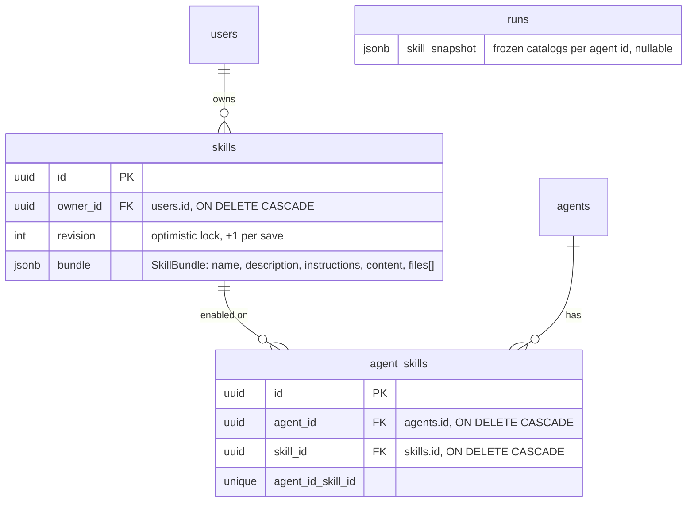

# Skills: implementation blueprint

State of `feat/skills-preview` as of 2026-09-08, written as a reference for a
reimplementation. Section 6 describes the original, larger design that was
removed on 2026-09-07 so the reasoning behind the simplification is not lost.

## 1. What a skill is

A skill is a `SKILL.md` plus optional supporting files, following the open
Agent Skills layout. The only mandatory structure is YAML frontmatter with
`name` and `description`; the body is the procedure. Files are free-form
relative paths, so `scripts/`, `references/` and `assets/` are convention,
not schema.

| Field | Rule (backend `SkillBundle`) |
| --- | --- |
| `name` | 1–64 chars, `^[a-z0-9]+(?:-[a-z0-9]+)*$` |
| `description` | 1–1024 chars |
| body (`instructions`) | 1–100 000 chars |
| `files[]` | ≤100 entries, path `[a-zA-Z0-9_.\-/]+` with no traversal, ≤10 MB total, binaries base64 |

Parsing lives in `backend/app/skills/bundles.py`. `parse_skill` splits the
frontmatter with a regex, `yaml.safe_load`s it, reads only `name` and
`description`, and keeps the raw markdown as `content`. Unknown frontmatter
keys survive only inside that raw text. Import accepts a zip with exactly one
`SKILL.md` at any depth (its folder becomes the root) or a bare `.md`.

The web editor never sends YAML the user typed: it composes the frontmatter
from the name and description inputs (`web/src/app/(protected)/skills/lib/skill-form.ts`,
`yamlScalar` quotes anything YAML could misread) and appends the body.

## 2. Data model

Two tables, `skills` and `agent_skills`, plus one nullable column on `runs`.
There are no versions: a save replaces the bundle in place, and every agent
with the skill enabled picks the new content up on its next run.

Three migrations, in order: `ab12cd34ef56` (original versioned model),
`cd34ef56ab78` (collapse to editable bundles; renames the legacy
`skill_versions` / `skill_tests` tables instead of dropping them),
`de56ab78cd90` (drop `visibility`). A fresh implementation would squash these
into one.

Design points worth keeping in mind:

- **One JSONB blob per skill.** Files, including base64 binaries, are inline.
  Simple and provider-independent, but the list endpoint returns every file of
  every skill, and each run snapshot copies the whole bundle.
- **`content` and `instructions` are both stored.** `instructions` is derived
  and only feeds a size check, yet it is part of `digest()`. Store the raw
  markdown and derive the rest.
- **`revision`** is the optimistic-concurrency token. A save with a stale
  revision gets 409.
- **`digest()`** is `sha256(model_dump_json())`. It names the sandbox directory,
  so any byte change gives a fresh directory and old files can never shadow
  new ones.

## 3. Authorization

Every skill is readable and usable by every workspace user. Only the owner or
a workspace admin can edit or delete it (`SkillService.authorize(edit=True)`
raises 403). Attaching to an agent requires `editor` on the agent through the
normal `AgentService.require_permission` gate; listing an agent's skills
requires `member`.

## 4. Attachment and runtime

**Attach** (`PUT /agents/{agent_id}/skills/{skill_id}`) inserts one
`agent_skills` row. It is idempotent. **One skill set per graph** (decided
2026-09-09): a supervisor and its subagents share the union of their attached
skills at run time, so the name must be free across the whole graph, not
just on this agent — a second, different skill with the same `name` is
refused on any member (`SkillService.ensure_no_name_collision`, which also
runs when a subagent joins a supervisor, since that merges two sets). The
same skill on several members is one entry. Detach deletes the row. Renaming
a skill while it is attached anywhere is refused so a stale name can never
appear in a running catalog.

**Run creation.** The worker calls `prepare_run_skills` before building the
agent (`backend/app/skills/snapshots.py`):

1. If the run already has a `skill_snapshot`, reuse it (retries).
2. If the run is a resume command, reuse the snapshot of the thread's last
   interrupted run, so an approval does not silently swap skill contents.
3. Otherwise resolve, for the parent agent and every subagent, the current
   bundles of their attached skills, and write the result to `runs.skill_snapshot`.

The snapshot is keyed by agent id. `resolve_skills` re-checks that the user
still has access on every resume; a saved snapshot never grants access on its
own. Saves therefore apply to the *next* run, never to one in flight.

**Exposure to the model** (`backend/app/skills/middleware.py`, since
2026-09-08). deepagents' own `SkillsMiddleware`, subclassed as
`FreshSkillsMiddleware` so the index is re-read on every run instead of once
per thread, and given this app's prompt template. It appends the skill list
(name, description, path) to the system prompt; the agent reads `SKILL.md`
and supporting files with the filesystem `read_file` tool. No custom tool.
An agent with no skills gets no middleware and no prompt fragment, as in
`create_deep_agent`.

**Materialization** (`backend/app/skills/runtime.py`). `Agent.build` merges
the per-agent catalogs into one (`merge_catalogs`, which fails the run on a
name collision that slipped past the attach-time check) and every agent in
the graph gets it. Files live under `/tmp/auxilia-skills/<skill-name>/`,
one root for the graph. For a sandboxed run, `materialize_skills` recreates
that root and uploads every file once when the sandbox is connected
(`Agent._open_sandbox`), before the graph is built. For an agent without a sandbox, `SkillFilesMiddleware`
(`app/skills/middleware.py`) writes the same paths into the agent's own
checkpointed `files` state, as a diff against what the thread already holds
(unchanged files untouched, changed ones rewritten, paths under the agent's
root that are no longer a skill deleted). deepagents' `StateBackend` serves
that state to `SkillsMiddleware` and to the only two tools such an agent gets,
`ls` and `read_file`. Nothing is written to any host filesystem and no process
runs: a sandbox-less agent reads data from its own state and nothing else.
Sandbox copies are writable but never written back.

Because the set is shared, a supervisor without code execution reads a
skill from its state and delegates the script to a sandboxed subagent by
absolute path; the subagent lists the same skill and finds the same path in
the run's one sandbox. The supervisor's prompt variant says so
(`SKILLS_SYSTEM_PROMPT_NO_SANDBOX`).

## 5. What happens when something is removed

| Event | Effect |
| --- | --- |
| Delete a skill (`DELETE /skills/{id}`) | Refused with 400 while any `agent_skills` row exists. Detach first. |
| Delete an agent | `agent_skills` rows cascade. The skill is untouched. |
| Delete a user | Their skills cascade, and so do those skills' `agent_skills` rows. Other users' agents lose the skill silently. |
| Remove a file from a skill | Next run gets a new digest, hence a new sandbox directory. Old directories linger until the sandbox is recycled. |
| Edit a skill mid-run | Nothing changes for the running or interrupted run; it keeps its frozen snapshot. |
| Detach during an interrupted run | The resume reuses the interrupted run's snapshot, so the skill stays available until that run finishes. |

## 6. The original design, and how AI editing worked

The first commit (`62c965b`, 2634 lines) shipped a much larger model. It was
cut back to the current one in `e9b3e6f` (−1350 / +463). Knowing what was there
helps decide what to bring back.

**Versioned model.** `skills.draft` held the editable bundle;
`skill_versions` held immutable published copies numbered per skill;
`agent_skills.version_id` pinned an agent to one version (`ON DELETE RESTRICT`,
so a used version could not disappear). Publishing later versions did not move
existing agents. The bundle carried extra fields: `title`, `requires_code`,
`required_mcp_server_ids`, `examples[]` (prompt + expected) and
`change_summary`. `SkillService.missing()` checked at attach time and at run
time that the agent had a sandbox when `requires_code` was set and that every
required MCP server was bound.

**Draft tests.** `skill_tests` bound a thread to a frozen copy of the draft.
`resolve_skills` substituted that copy into the *parent* agent's catalog for
that thread only, so a draft could be tried without touching the agent's
published selection. The UI let the author mark the result passed or failed
and save the exchange as an example.

**AI authoring.** Three extra LangChain tools were added to every parent
agent, built per user (`authoring_tools(user_id)`):

- `list_editable_skills()` returned the skills the user could edit.
- `read_skill_draft(skill_id)` returned the current draft and its revision.
- `save_skill_draft(bundle, skill_id?, revision?)` accepted a complete
  `SkillBundle` as tool arguments, so the model had to emit every file in full,
  and wrote it to the draft with its own `AsyncSessionLocal()` transaction.

So the loop was tool-based and database-bound, not sandbox-bound. Nothing was
uploaded back from the sandbox: sandbox copies stayed disposable, and the model
had to pass file contents through the tool call. Publishing was deliberately
impossible from a tool. Two UI shortcuts drove it: a **Save as skill** button in
the chat composer that prefilled a prompt asking the agent to call
`save_skill_draft`, and **Try & teach → Edit with AI** that opened a thread
with the selected agent and an explicit edit request.

**Why it was cut.** The version and test tables tripled the schema for a
preview, the requirement checks duplicated what the sandbox and MCP layers
already enforce, and the authoring tools were the least predictable part
(a 10 MB bundle through tool arguments does not work). The simplification kept
the parts that proved stable: the bundle format, the per-run snapshot, the
single `read_skill` tool and the verified sandbox upload.

## 7. Size of the change

| Slice | Files | Lines |
| --- | --- | --- |
| Branch vs `main`, including today's uncommitted work | 35 | +2379 / −12 |
| Backend (module, migrations, runtime hooks, tests) | 23 | ≈ +1230 |
| Frontend (skills pages, files panel, form helpers, agent checkbox panel) | 12 | ≈ +1150 |
| Touch points in existing code | `agents/runtime.py` +52, `sandbox/lazy.py` +24, `runs/worker.py` +5, `runs/models.py` +1, `main.py` +2, `alembic/env.py` +2 |

Roughly 2 250 lines of source live in the skills module and pages today.
Tests: 21 backend (service, runtime, bundles, router URL) and 5 frontend
(YAML composition, name validation, upload routing).

## 8. How this compares with deepagents 0.7.13

deepagents ships its own implementation of the same pattern:
`SkillsMiddleware` (`deepagents/middleware/skills.py`), enabled with
`create_deep_agent(skills=["/skills/user/", ...])`. Our runtime does not use
it. `build_runnable` reproduces `create_deep_agent`'s stack middleware for
middleware (see `harness.py`), but skills are the one feature it re-implements
by hand.

What deepagents does:

- Skills are directories in a **backend** (state, filesystem, sandbox or
  composite): `<source>/<skill-name>/SKILL.md` plus files. Discovery is
  `backend.ls(source)` followed by one `download_files` of every `SKILL.md`.
- Frontmatter parsing follows the Agent Skills spec: `name` and `description`
  required, `license`, `compatibility`, `metadata` and `allowed-tools`
  optional. The name must match the directory name (a warning, not a
  rejection). `allowed-tools` is listed in the prompt; nothing enforces it.
- Disclosure goes through the **system prompt**. A `## Skills System` section
  lists each skill's name, description and path, and tells the model to call
  the filesystem `read_file` tool for the full text. There is no dedicated
  skill tool.
- The index is loaded once in `before_agent` and kept in agent state for the
  life of the thread. Later turns skip the load, so an edited description is
  never re-read on an existing thread, although `read_file` still returns the
  current file.
- Subagents can declare their own `skills` sources; forks inherit the parent's.

Where we match: bundle format and limits, on-demand full read, one catalog per
agent and per subagent, files materialised next to `SKILL.md`, prompt-cache
friendly because nothing changes within a run.

Where we differ, and why:

| Topic | deepagents | auxilia | Assessment |
| --- | --- | --- | --- |
| Source of truth | Files in a backend | Postgres row, materialised into the sandbox | Ours is right for a multi-tenant web app; theirs assumes a filesystem you own |
| Disclosure | System-prompt section | `read_skill` tool description | Equivalent progressive disclosure. Ours keeps the system prompt byte-stable per thread, which the DeepSeek cache needs |
| Full read | `read_file` on the backend | `read_file` too (since 2026-09-08) | Sandbox-less agents read from `StateBackend`, deepagents' own default |
| Freshness | Index cached for the thread | Snapshot per run | Ours meets "update applies to every agent immediately" on the next turn; theirs would need the state cleared |
| Loading time | `before_agent`, at run start | Files uploaded when the sandbox connects | Their loader would `ls` our lazy sandbox before it is connected and find nothing |
| Directory naming | `<source>/<name>/SKILL.md` | `<root>/<name>/<digest>/SKILL.md` | Incompatible: their scan expects `SKILL.md` directly under the name directory |
| Extra frontmatter | Parsed and shown | Dropped | Theirs is closer to the spec |

Verdict: the behaviour is on par with what deepagents recommends, the
mechanism is not. To adopt `SkillsMiddleware` instead of `read_skill`, a
reimplementation would need:

1. A small read-only `BackendProtocol` over the run snapshot (`ls`,
   `download_files`, `read`), routed under `/skills/` with `CompositeBackend`
   so it works before the sandbox connects and on agents without one.
2. Flat directories, `/skills/<name>/SKILL.md`, dropping the digest segment.
   Freshness then comes from the snapshot, not the path.
3. Clearing `skills_metadata` at the start of every run, or a subclass whose
   `before_agent` always reloads, to keep updates immediate.
4. `FilesystemMiddleware` on the non-sandbox path too, since `read_file` is
   how the model reads the skill. Done with `StateBackend`, not the snapshot
   backend or a temp dir: a sandbox-less agent must not touch any process or
   host filesystem.

Verified against the installed package (0.7.13), 2026-09-08:

- `BackendProtocol` methods default to `raise NotImplementedError`, so a
  read-only backend only needs `ls`, `read`, `download_files`, `glob` and
  `grep` (the last two can return empty results). Writes fall through to the
  protocol default and surface as tool errors.
- `CompositeBackend.execute` delegates to the default backend when it is a
  `SandboxBackendProtocol`; `LazySandboxBackend` extends `BaseSandbox`, so
  `execute` keeps reaching the sandbox while `/skills/` reads hit the snapshot.
- `FilesystemMiddleware(tools=["ls", "read_file"])` limits the tool surface,
  so a sandbox-less agent gains read access to its skills without gaining
  `write_file` or `edit_file`.
- `SkillsMiddleware.before_agent` returns early when `skills_metadata` is
  already in state, so a subclass that drops the guard is what keeps the index
  fresh per run.

What stays: Postgres as source of truth, `resolve_skills` and the per-run
snapshot, attach/detach, and the sandbox upload for scripts (a script must be
on the sandbox disk to run; the snapshot backend only serves reads). What goes:
`catalog_tools` / `read_skill` and its "sandbox path after connecting" text.
Net size is about the same as today's `skills/runtime.py`; the gain is using
the framework's read path, prompt fragment and frontmatter parsing rather than
maintaining a parallel one.

## 9. Decision: eager sandbox per run

Decided and implemented 2026-09-08 (uncommitted on `feat/skills-preview`;
verified live against the Cloud Run sandbox: skill script ran on turn one, a
marker file written there was read back on turn two). An agent bound to a
sandbox gets a live sandbox as part of starting a run. The runtime owns the
lifecycle; the model never creates or reconnects anything.

Why: today the sandbox id lives only in a tool message, so the model has to
call `connect_sandbox(id)` on every turn and loses the files when it forgets.
Agents bound to a sandbox are expected to use it, so paying the connect cost
up front is the right default. `CloudRunProvider.connect` already reattaches
to a live sandbox before it looks at a snapshot, so a warm instance costs one
liveness check and only a cold one pays the tar restore.

What changed:

1. **`threads.sandbox_id`** (migration `ef67ab89cd01`). Stamped by the runtime
   in its own short transaction when a run creates or replaces the thread's
   sandbox. Server-side only; not in `ThreadResponse`.
2. **`open_sandbox(provider, sandbox_id)`** in `app/sandbox/provider.py`:
   reconnect when the thread has an id, else create. Providers raise
   `SandboxGoneError` for the one recoverable case (gone, no snapshot), which
   yields a replacement plus `SandboxSession.replaced=True`; anything else
   fails the run. Called from `Agent._open_sandbox` inside `_setup`, before
   the graph is built, in a worker thread.
3. **Skills upload on that connect**, flat under
   `/tmp/auxilia-skills/<name>/`, root recreated each run.
4. **`app/sandbox/lazy.py` and `app/sandbox/tools.py` deleted**, with their
   tests. deepagents ships no lifecycle tools either; its filesystem middleware
   assumes a live backend, which is what it now gets.
5. **One sandbox per run**, shared by the parent and every sandbox-bound
   subagent (`ResolvedAgent.compile(sandbox_backend=…)`), so the parent's
   turn-end persist covers subagent writes (issue #302).
6. **Turn-end persist** unchanged, now on `SandboxSession.persist`.
7. **Host notice**: when the sandbox was replaced, `_with_host_notice`
   prepends `HumanMessage(name="host", additional_kwargs={"host_notice":
   "sandbox_replaced"})` to the turn's input; the chat renders it as a muted
   event line (`isHostNotice` in `conversation-body.tsx`).
8. **Skills upload only when needed** (2026-09-09). `materialize_skills`
   writes a `.auxilia-digest` marker next to the skills; a reconnect whose
   marker matches costs one `cat` and uploads nothing. A new sandbox, or a
   skill saved since, recreates the root and uploads everything. Detaching
   every skill removes the root.
9. **Provider "gone" mapping** (2026-09-09). Cloud Run: no live sandbox and
   no snapshot. OpenSandbox: API 404 (TTL expired or deleted), unhealthy, or
   ready-timeout. Daytona: `DaytonaNotFoundError` or a dead state. Everything
   else (auth, quota, 5xx, network) fails the run — a provider outage must not
   silently spawn sandboxes.
11. **Provider outage is a typed pre-run failure** (2026-09-09).
    `SandboxUnavailableError` (409, body `{"error": "sandbox_unavailable",
    "sandbox_id", "detail"}`) mirrors `ModelUnavailableError`. Every provider
    has a cheap `_probe` (Cloud Run `GET /health`, OpenSandbox one-item
    listing, Daytona one-item listing); `ensure_sandboxes_available(rows)`
    runs it for every sandbox the agent graph is bound to. Two callers:
    `RunService._ensure_runnable_thread` (all launch paths: web, Slack,
    triggers, API) and `AgentService.describe_readiness`, which reports
    `status: "sandbox_unavailable"` so both chat pages replace the composer
    with a notice and a "Check again" button. `open_sandbox` raises the same
    error for a connect/create failure that is not "gone", covering the race
    between the gate and the worker. The model never sees any of it.
10. **Non-login shell on Cloud Run** (2026-09-09). `bash -c`, not `-lc`: the
    image's login shell printed a `.bash_profile` permission error on stderr
    for every command, and deepagents' file tools parse `execute`'s combined
    output as JSON.

**Telling the model its sandbox was replaced.** When step 2 falls back from
connect to create, the runtime prepends one host-authored message to the
turn's input: `HumanMessage(name="host", additional_kwargs={"host_notice":
"sandbox_replaced"}, content="[Host notice] …")`. It is persisted in the
checkpoint like any message, rendered by the chat as a muted event line rather
than a user bubble, and skipped by the Slack consumer. Not the system prompt
(frozen per thread for the DeepSeek cache), not a mid-history `SystemMessage`
(rejected by Anthropic), not transient per call (lost once the run ends).

This is how every surveyed harness does it (checked 2026-09-08):

- LangChain's `SummarizationMiddleware` inserts the summary as a
  `HumanMessage` tagged `additional_kwargs={"lc_source": "summarization"}`;
  deepagents patches dangling tool calls with synthetic `ToolMessage`s and
  replaces oversized results with a `ToolMessage` pointing at a file.
- OpenHands' SDK converts `CondensationSummaryEvent` and hook feedback to LLM
  role `user` with `source="environment"`, so the transcript keeps who wrote it.
- Claude Code rides `<system-reminder>` blocks in the user turn, tagged so the
  model can tell harness text from tool output. Its Bedrock bug (three or more
  reminder blocks ahead of the user's text made the model drop the user's
  message) is the argument for one short notice, not a stack of them.
- Google ADK appends an `Event(author="system")` to the session through
  `append_event`; OpenAI's Agents SDK says the model sees only conversation
  history, so extra context goes into the `input` list below the instructions.
- Manus keeps failed observations in context on purpose and warns that any
  mutation at the start of the system prompt kills the cache prefix.

Harness parity: `FreshSkillsMiddleware` reports `name == "SkillsMiddleware"`
so it fills deepagents' slot, and `tests/agents/test_harness_parity.py` builds
the stack with skills both ways and compares (second entry in
`EXPECTED_DEVIATIONS`). The non-sandbox read path first used a per-run temp
dir with `FilesystemBackend`; replaced on 2026-09-09 by `StateBackend` plus
`SkillFilesMiddleware` so a sandbox-less agent never touches the worker's
disk (`test_plain_agent_reads_skills_from_state_end_to_end` runs the real
graph and checks the prompt, the tools offered and the state).

## 10. Notes for a reimplementation

Keep:

- The bundle format and limits. They match the Agent Skills standard's minimum.
- `read_skill` with the manifest in the tool description. It is cheap
  progressive disclosure and keeps the system prompt frozen for prompt caching.
- Freezing bundles per run and reusing them across retries and resumes.
- Content-hashed sandbox directories with a read-back verification.
- Explicit save with a revision token, no autosave.

Change:

- Store the raw markdown once; derive `name`, `description`, `instructions`.
- Model the standard's optional frontmatter (`license`, `compatibility`,
  `metadata`, `allowed-tools`) or reject unknown keys explicitly, so round-trips
  are honest. Adopting `SkillsMiddleware` (section 8) gives this for free.
- Split the list endpoint from file contents. Return `{id, name, description,
  file_count}` for the library and load files on the detail page.
- Reference bundles by digest from run snapshots instead of copying them, once
  a blob table or object store exists.
- Give the agent-side checkbox panel (`agent-skills.tsx`) the same treatment as
  the editor; it is still the unstyled preview version.
- If AI authoring returns, make it write files through the sandbox (the agent
  edits a working copy, a tool diffs and saves it) rather than passing whole
  bundles as tool arguments.
